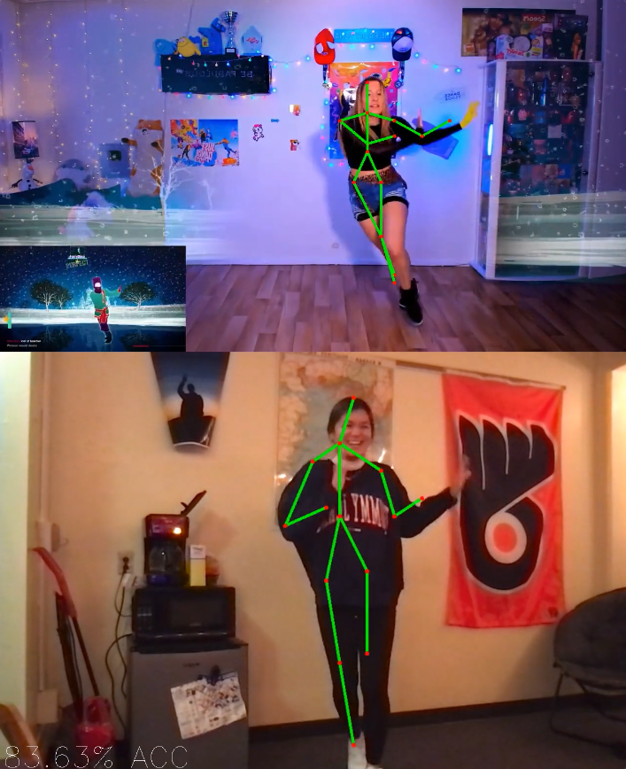

# Open Dance

## Inspiration

When we are hanging out with our friends, we want to dance, and since not many people have Just Dance or a video game console, it has been a struggle to find an activity to do that involved dancing. So we wanted to create a dancing game that would allow users to download and play for free, and also have the ability to choose any song instead of choosing from a limited selection.

## What it does

Open Dance allows users to search any music video on the internet and dance to it while earning a score at the end of the song based on the accuracy of the dancing.

## How we built it

OpenDance runs on the [OpenPose](https://github.com/CMU-Perceptual-Computing-Lab/openpose) technology developed by the Carnegie Mellon Perceptual Computing Lab. OpenPose is a real-time system to detect human keypoints on images and videos. Our program tracks the difference in angles between the lines connecting keypoints to determine an accuracy score.

## Running

To run:

Ensure you meet the preqrequistes to run OpenPose. They can be found [here](https://github.com/CMU-Perceptual-Computing-Lab/openpose/blob/master/doc/installation/1_prerequisites.md)

macOS users who have git already installed can get all dependencies (including HomeBrew) and code by running:

`curl -s https://raw.githubusercontent.com/MyYogurt/OpenDance/main/macOS%20Install%20Script.sh | bash`

Once all code and dependencies are installed run:

`python openpose.py --dataset MPI --model ./openpose/models/pose/mpi/pose_iter_160000.caffemodel --proto ./openpose/models/pose/mpi/pose_deploy_linevec_faster_4_stages.prototxt` 

## What Needs to Be Improved

- Usability: Users need to record themselves dancing and run the program with a dancing video they already have downloaded. This results in cumbersome operation.
- Design: The GUI is rudimentary due to our little knowledge of Python's tkinter library. 
- Portability: The application has a large file size, has a complex installation process.
- Performance: The program isn't fast enough to perform real time computation. Even without realtime computation, it is extremely slow and requires a powerful computer to run.

## Potential Ways to Implement These Improvements

- Usability: Implement a feature to allow downloading Youtube videos. This could be done with technology such as [youtube-dl](https://youtube-dl.org). Implement a feature to record through the webcam.
- Design: Study and learn how to better use the tkinter library. Potentially use bundles or packages such as Docker to ensure easy downloads that contain all dependencies.
- Portability: We have a prototype that runs in a web browser using javascript and tensorflow. However at this time it is not usable.
- Performance: Optimize the program. Compile OpenPose and it's Python API to use OpenCV or CUDA to allowed for GPU processing. Potentially use a model that is not as accurate but easier to compute.